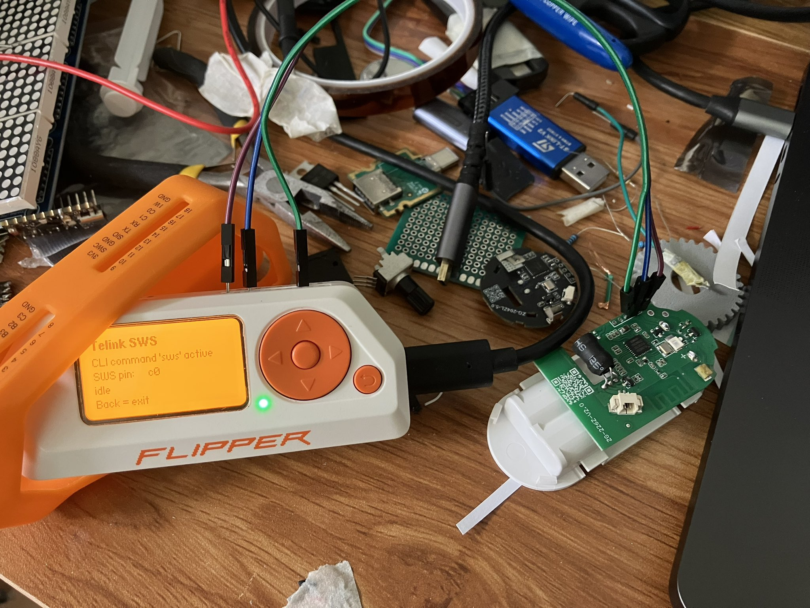

# Telink flasher via Flipper Zero

This is a Telink flasher using bitbang, can run on Flipper Zero.

This allows reflashing TLSR chips, namely cheap Tuya devices.

This project is highly vibe-coded, refer to `AGENTS.md` for more info.

## How to use it

Compile flipper app in `telink_sws` with [ufbt](https://github.com/flipperdevices/flipperzero-ufbt) (SDK must match your firmware API): `cd telink_sws && ufbt launch`

Wiring: target SWS pin to Flipper `C0`, `C1` or `C3`, GND to GND, and target VCC to Flipper 3V3 (pin 9).

While the app is open, it registers the `sws` command on the Flipper CLI (e.g. via `ufbt cli`):

- `sws help`: list commands and current state (pin, timing unit, divider)
- `sws power on`, `sws pin c0`, `sws act`: power the target, select pin, activate SWS
- `sws id`: read the chip ID; `sws jedec`: read the SPI flash ID
- `sws dump 0 0x80000 /ext/fw.bin`: dump 512 KB of flash to the SD card (verified by default)

Example dumps are in `dumps/`.

## Credits

This project is inspired by:
- https://github.com/pvvx/TLSRPGM
- https://github.com/pvvx/TlsrComProg825x
- https://github.com/pvvx/ZigbeeTLc
